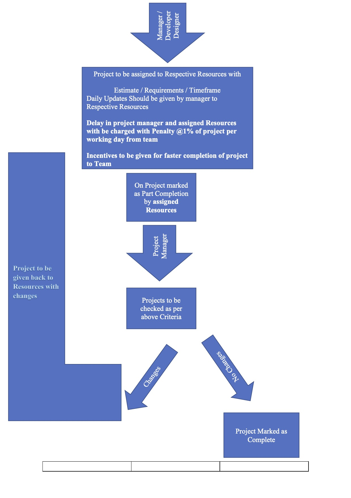

# Readme
Rules, Information & Help 

**Website / Software Development &amp; Testing &amp; Review Process**

- Read Requirements - Estimate Carefully
- Count the Features /Pages which are needed in the features
- Check and verify all pages &amp; Functions one by one
- Put test Data &amp; check the same
- Check all the data are working and posted in database
- If any of the features are not added directly project to Rejected
- Check the design of the frontend if not up to the mark reject it
- Design should be neat &amp; Clean
- Verify the forms twice and check data that are getting posted also name tag is used.
- Check all working links. Not working links should be removed or edited
- Each function should be easy to use
- Check for photo they should properly work in both mobile and desktop
- Check every function in mobiles too specially design
- There should be no console Errors
- Spellings should be checked
- Buttons, Form Should be named correctly
- All **CSS** files should be on top and **js** at bottom
- If Project is **verified** then **verifier** is responsible for errors found in projects
- Projects should be Delivered at least **7 days** before ETA. It is Project Manager&#39;s Responsibility for smooth &amp; timely delivery of projects
- MAIL / SMS/ NOTIFICATIONS Functions Should be checked manually
- Logo should be resized and optimized as per requirements. Extra large images should not be used
- Inline CSS And JS Should not be used

Eg:

`

`

`<style>opacity:0.5;position:absolute;left:50px;top:-30px;width:300px;height:150px;background-color:#40B3DF<style>`

`	`
 
 
 ## Form:

` <form action="/action_page.php">
  First name: 
  <input type="text" name="firstname" value="Mickey">
   
  Last name: 
  <input type="text" name="lastname" value="Mouse">
    
  <input type="submit" value="Submit"></form> `

## Image

`  `

## Design UI , Facebook Creative, Print Design - Testing Guidelines**

- Check for Color and theme it should reflect branding of project e.g. logo
- 4 types(1)of logo should along with Raw file i.e. PSD , AI, EPS.

1. 144p 512p 1024p Colored / Black White
2. Logo should be transparent background

- Spelling Should be checked
- The design should look good
- Everything should be formatted as per given concepts
- All pages should be present
- Logo should be resized as per requirements

